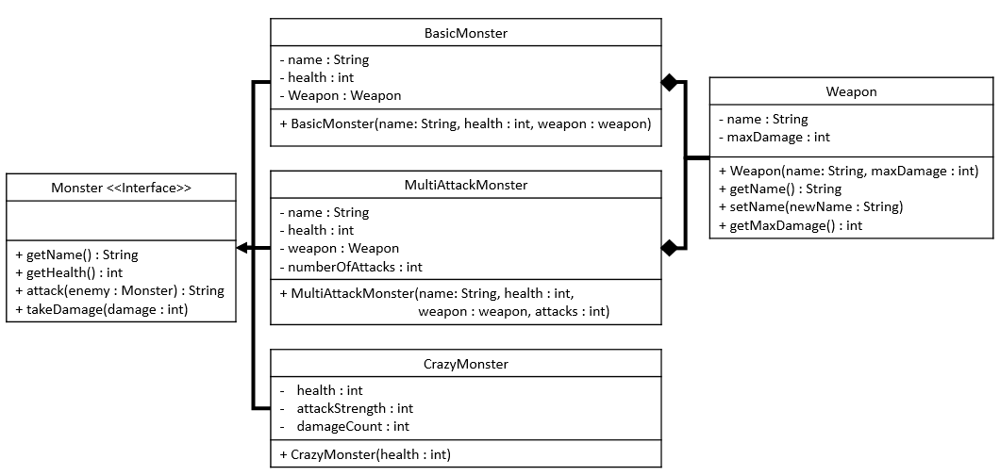

# 🧟‍♂️ ASSN05 — Monster vs Monster

Welcome to Monster *vs.* Monster, a project that will turn you into a monster (in a good way) of  **class design, interfaces, polymorphism,** and **`ArrayList` processing**.

In this assignment, you will implement multiple classes that all derive from the same **Monster interface** (recall that an interface is like a contract; any class that `implements` the interface must also create bodies for the methods specified in the 'contract').

Next, you will use those classes in a simulated battle. The goal is to not only create a working program program but also demonstrate you understand **why** your program works!

You are expected to write **clean, structured, testable, and well-explained code**, just like you would on the AP Exam 🤓.

---

## 🧠 Explanation & Reflection (Required)

Before diving into your implementation, you must include a **brief explanation of your thinking**. This may be written in either:

* A separate file, located in `src\main\resources\STUDENT_README.md`  
**OR**
* Clear, insightful comments within your code

Your comments or README file must:

* Explain **what your program does at a high level**
* Explain **why your logic works** (especially for loops, `ArrayList` processing, and the Monsters' attack logic)
* Mention any **challenges, assumptions, or design decisions** you made

> Remember: On the AP Exam, correct output alone is not enough — you earn points for demonstrating **reasoning and program design**.


---
## 🧩 Project Overview

You are given:

* A **Monster interface** (the contract your classes must follow)
* A fully implemented **Weapon class**
* A data file to read from: `MonsterData.txt`

Your job is to:

1. Write up three different Monster classes that all implement the same interface
2. Process monster data using `ArrayList` logic
3. Simulate a **battle between Monsters** using the concept of polymorphism

Even though interfaces are not directly tested on the AP Exam, they reinforce **method signatures, abstraction, and interchangeable object behavior** — all essential AP CSA concepts!

---

## 🏗️ Part 1 — Structure (UML & Class Design)

Refer to the provided **UML Class Diagram** before writing any code:


You must correctly implement:

* Class names
* Instance variables
* Constructors
* Method signatures and bodies

> ⚠️ Your code should pass all **structure tests** before you move on to behavior. If your method names, return types, or parameters are incorrect, your logic will not be able to be tested.

---

## ⚔️ Part 2 — Behaviors

All Monsters must store a **name**, a **health value**, and implement the methods defined in the **Monster interface**. However, each class will behave differently when attacking and taking damage.

---

## 🧟 Part 2.1 — `BasicMonster`

#### The `BasicMonster` class should have the following behaviors:

* Appropriate accessor methods for the `name` and `health` instance variables. 
* The `takeDamage` method should subtract the amount passed as an argument from `health`. For example, given a `BasicMonster` named myMonster with a health of 100, after calling `myMonster.takeDamage(25)`, `myMonster.getHealth()` should return 75.
* The `attack` method should compute a random damage (an integer) between 1 and the `maxDamage` of this Monster's `Weapon`. The method should then call the `takeDamage` method on the Monster that was passed into the `attack` method as an argument, passing the computed damage amount as the argument. This method should also construct and return a String formatted exactly as shown below:
```
<this monster name> attacks <enemy name> with <weapon name> doing <damage> damage
```
For example, if a Monster named "Fred" attacks a Monster named "Amy" with an "Axe" and does 10 point of damage, then the String returned by the `attack` method should look exactly like this:
```
Fred attacks Amy with Axe doing 10 damage
```
---

## 🧟‍♂️ Part 2.2 — `MultiAttackMonster`
#### The `MultiAttackMonster` class should have the following behaviors:

* Appropriate accessor methods for the `name` and `health` instance variables.
* Implement `takeDamage` to behave in the same way as a `BasicMonster`.
* The `attack` method should compute a random damage (an integer) between 1 and the `maxDamage` of this Monster's `Weapon`. The method should then call the `takeDamage` method on the Monster that was passed into the `attack` method as an argument, passing the computed damage amount as the argument. This method should repeat the steps of computing a random damage and calling the `takeDamage` method on the argument Monster for a number of times that is equal to this Monster's `numberOfAttacks`. This method should also construct and return a String formatted as shown below:
```
<this monster name> attacks <enemy name> with <weapon name> doing <damage> damage
```
For example, if a `MultiAttackMonster` named "Fred" attacks a Monster named "Amy" three times (because Fred's `numberOfAttacks` is 3) with an "Axe" and does 5 points of damage on the first attack, 3 points of damage on the second attack, and 7 points of damage on the third attack, the String returned by the `attack` method should look exactly like this:

```
Fred attacks Amy with Axe doing 5 damage
Fred attacks Amy with Axe doing 3 damage
Fred attacks Amy with Axe doing 7 damage
```

---

## 🤪 Part 2.3 — `CrazyMonster`

#### The `CrazyMonster` class should have the following behaviors:
* Appropriate accessor methods for each instance variable.
* The `CrazyMonster` constructor should set `health` to the value passed in as an argument, but initialize `attackStrength` to 1 and `damageCount` to 0.
* The `takeDamage` method should subtract the amount passed in as an argument from `health`. For example, given a `CrazyMonster` named `myMonster` with a health of 100, after calling `myMonster.takeDamage(25)`, `myMonster.getHealth()` should return 75. The method must also increment the `damageCount` instance variable; additionally, if `damageCount` is an even number, then this Monster's `attackStrength` should be increased by the damage amount.
* The `attack` method should compute a random damage (an integer) between 1 and this Monster's `attackStrength`. The method should then invoke `takeDamage` on the Monster that was passed into the `attack` method as an argument, passing the computed damage amount as the argument. This method should also construct and return a String formatted as below:
```
<this monster name> attacks <enemy name> doing <damage> damage
```
For example, if a `CrazyMonster` named "$@!!&" attacks a Monster named "Amy" and does 10 points of damage, the String returned by `attack` should look exactly like this:

```
Fred attacks Amy doing 10 damage
```
---

## 🏟️ Part 3 — Monster Battle Simulation (`Main` Class)

You will now build your knowledge of **polymorphism**, orchestrating a full Monster battle!

First, you will need to create an `ArrayList` named `monsterNameData`, and then process the 'MonsterData.txt' file (located under the `resources` folder) so that the following String data gets stored inside the said ArrayList:

```
["str-Goblin", "40", "str-Orc", "60", "str-Troll", "70"]
```
Then, after creating another `ArrayList` called `healthData`, iterate through `monsterNameData` with the following specifications:

#### If the element contains "str-"

1. Remove the "str-" prefix and set the current element to this modified value.

2. Otherwise, assume the element is a String representation of an Integer, and use the static `valueOf` method to parse the Integer. Then, add the element to `healthData` and remove it from `monsterNameData`.

At the end, `monsterNameData` should contain: 
```
["Goblin", "Orc", "Troll"]
```

and `healthData` should contain: 
```
[40, 60, 70]
```

---

## 🧪 Step 2 — Create Monsters

Create an ArrayList that is able to store the active participants in the battle. Then, using the information contained in `monsterNameData` and `healthData`, instantiate one object of each Monster type (`BasicMonster`, `MultiAttackMonster`, and `CrazyMonster`) and add them to this list.

Each `Monster` must be constructed using a name and a health value that correctly correspond to one another based on how the data was processed in the previous steps. **Your solution should work systematically rather than using hard-coded values**, ensuring that the relationship between the two data lists is preserved as `Monsters` are created.

## 🧠 Concept Reminder: Inheritance & Reference Types

In Java, classes can be related to each other through the concept of inheritance, which means that one class can be a more specific version of another (aka, it has additional or modified members compared to the parent class or interface). Even if that child class does declare additional members, it still overlaps with the methods and fields present in the parent class.

Because of this relationship, a variable in your program does not always have to be declared using its most specific class name. Instead, it can be declared using a more general reference type, as long as the program bears in mind what overlaps between the actual object assigned to the variable and the variable's declared type. 

This idea is especially useful when working with collections, where multiple objects that share common behavior need to be stored, accessed, and acted upon in the same way.
---

## ⚔️ Step 3 — Battle Loop

While **at least two Monsters are alive**, for each Monster that is still alive, randomly pick an enemy for this Monster to attack. Then, have this Monster attack the chosen enemy Monster and print the String returned from the attack. Finally, announce the winner (if there is still one monster alive, then this is the winner).

---

## ✅ Success Criteria

You will be graded on:

* Correct **class structure**
* Proper **interface implementation**
* Accurate **attack and damage logic**
* Correct **ArrayList processing**
* Clean, readable, **explained code**

---

## 🚀 Final Reminder

This project is designed to feel like a **real AP CSA Free Response Question**.

Write code that:

* Works
* Is readable
* Is explainable
* Shows your thinking

You are also encouraged to carefully analyze your program's JUnit test results as well as the tests themselves to debug and better understand how your code is expected to behave!

Good luck — and may the strongest Monster win! 🧟‍♀️⚔️
